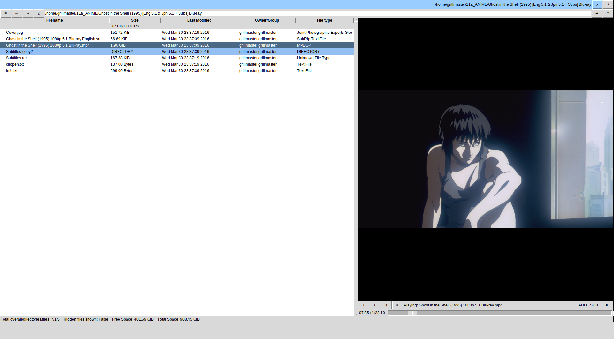

# marttkfmanager
A file manager made with tk



## Keyboard bindings:

 Keybind's Actions                          | Binds
 -------------------------------------------|-------------
 Toggle Showing Hidden Files:               | `Ctrl-h`
 Refresh:                                   | `Ctrl-r`
 Up Directory:                              | `Left`
 Change Directory/Open File:                | `Right`
 Move between Directory/Files:              | `Up/Down`
 Move between Directory/Files in 10 steps:  | `Ctrl-Up/Down`
 Beginning/End file of the directory:       | `Home/End`
 Move scrollbar up/down:                    | `Pageup/Pagedown`
 Quit program:                              | `Ctrl-q`

## Dependencies

Based on Debian package names, these may differ in other distros.

* python3
* tkinter
* python-pil
* python3-dev 

In Debian/Ubuntu, install those gstreamer1.0 dependencies as follow:

```
sudo apt install python-gi python3-gi \
    gstreamer1.0-tools \
    gir1.2-gstreamer-1.0 \
    gir1.2-gst-plugins-base-1.0 \
    gstreamer1.0-plugins-good \
    gstreamer1.0-plugins-ugly \
    gstreamer1.0-plugins-bad \
    gstreamer1.0-libav
```

To cover over these dependencies:

* python-gobject
* python-gst-1.0
* python-gstvideo

## Configuration

It's important to put the "marttkfmanagerrc" file in your home directory as ".marttkfmanagerrc" if you want to have a proper configuration file.

## Changelog - BETA

### 2016 NOV 13 BETA v0.1.5 - Changelog:
* Position of the Music Player changed from right-side to bottom
* Added music info, position, and duration
* Top button and Entry re-style/position
* Partial Fix for the opening video program via Button 1 while side-video player is playing (can still crash in some circumstances)
* Added rewind (<<) and forward (>>) seeker buttons 
* Added stop button

### 2016 NOV 12 BETA v0.1.4 - Changelog:
* Video player width fix
* Fixed Video player crash
* Text viewer only open on .txt files now

### 2016 NOV 10 BETA v0.1.3 - Changelog:
* Audio devices limited to 1
* Video player added

### 2016 OCT 25 BETA v0.1.2 - Changelog:
* Gstreamer - First time audio/basic music player implimentation

### 2016 OCT 05 BETA v0.1.1 - Changelog:
* Added for reading text files
* Tried to impliment audio (currently not working)

### 2016 OCT 04 BETA v0.1.0 - Changelog:
* Added side media preview for first time
 * Currently only for previewing pictures
 * BUG: Single-Click would be delayed by one image

## Changelog - ALPHA

### 2016 SEP 30 ALPHA v0.2.1 - Changelog:
* Added cut, copy, and paste feature in menu
* Added make directory feature in menu
* Empty directory can now right click: Moved from tag bind right click to whole of treeview/list
* Menu should unpost when click out of menu

### 2016 SEP 29 ALPHA v0.2.0 - Changelog:
* It can now do multiple selection of items (files/directories)
 * Used selection instead of focus
* Added duplication feature in menu
* Added renaming feature in menu
* Added delete feature in menu
* Widgets are inside either the 2 frames
* Resizeable directory list
* Layout change

### 2016 SEP 28 ALPHA v0.1.5 - Changelog:
* Added the ability to refresh and show/hide hidden files on right click menu

### 2016 SEP 21 ALPHA v0.1.4 - Changelog:
* Add right click menu
 * Ability to use alternative program/commands

### 2016 SEP 18 ALPHA v0.1.3 - Changelog:
* Fixed pos variable going out of range of history list
* Fixed mistake where history is set at current directory and not home
* Reduced LOC from 261 LOC to 252 LOC - No more variable assignment on top buttons and about label and button
* Renamed tkfmanager.py to marttkfmanager.py

### 2016 SEP 17 ALPHA v0.1.2 - Changelog:

* Less redundent code - Cut down of around ~40 SLOC (From 310 to 261 LOC/238 SLOC (including removing of 9 lined dependency comment))
 * Uses lambda instead in replace of simpler functions
* Display 'Directory don\'t exist' if user tries to enter a non-existent directory

### 2016 SEP 16 ALPHA v0.1.1 - Changelog:

* Use arrow keys to quickly navigate through directories and files
* Control-up/down for 10 steps
* Display 'Access Denied' if user cannot enter directory
* About window fixed

### From 2016 SEP 15 v00 to 2016 SEP 15 ALPHA v0.1.0 - Changelog:

* Turn it from a file browser to a basic file manager
* Change from release click to double click 
* Add more information on bottom: Free space V Total space
* Hide hidden files - Toggles with 'CTRL + H'
* Ability to refresh directory - Toggles with 'CTRL + R'
* Files ends with 'rc' are recognised
* Changed from PRE-ALPHA to ALPHA stage
* Change how up directory works
* Directory entrybox binded to keyboard-enter 
* Flexably uses between units (Bytes to YiB) on file sizes
* \xa0 used instead of _

## To-Do; Plans for later releases:

* Add find/search entrybox
* Add configuration button and window
* Main and About window style change


